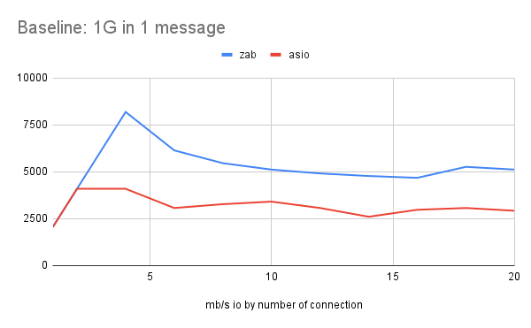
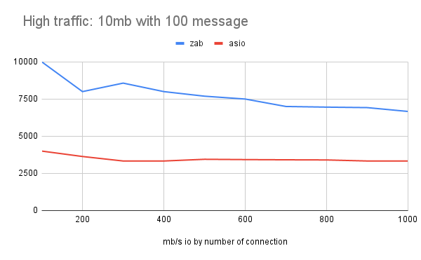

# zab_benchmark
Bechmarks for the ZAB async framework. 

Results from `Intel i7-10875H (16 core) `
## Baseline test - One 1G message with incresing connections

`./<server> <port>`
`./<client> <port> <hostname> x 1 1048576`

| 1 gig 1 message |  1   |  2   |  4   |  6   |  8   |  10  |  12  |  14  |  16  |  18  |  20  |
|-----------------|------|------|------|------|------|------|------|------|------|------|------|
| zab             | 2048 | 4096 | 8192 | 6144 | 5461 | 5120 | 4915 | 4778 | 4681 | 5266 | 5120 |
| asio            | 2048 | 4096 | 4096 | 3072 | 3276 | 3413 | 3072 | 2606 | 2978 | 3072 | 2925 |

.

## Baseline test - Onehundred 10Mb messages with incresing connections

`./<server> <port>`
`./<client> <port> <hostname> x 100 10240`

| 10 mb 100 message |  100  | 200  | 300  | 400  | 500  | 600  | 700  | 800  | 900  | 1000 |
|-------------------|-------|------|------|------|------|------|------|------|------|------|
| zab               | 10000 | 8000 | 8571 | 8000 | 7692 | 7500 | 7000 | 6956 | 6923 | 6666 |
| asio              |  4000 | 3636 | 3333 | 3333 | 3448 | 3428 | 3414 | 3404 | 3333 | 3333 |

.
## 10k Challange

`./<server> <port>`
`./<client> <port> <hostname> 10000 1 1024`

| 10k problem - 10k connections, 1 1mb message |   io throughput   |
|----------------------------------------------|-------------------|
| zab                                          | 3333              |
| asio                                         | 2000              |