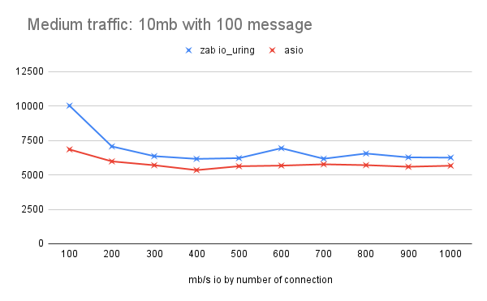

# zab_benchmark
Bechmarks for the ZAB async framework. 

Results from `Intel i7-10875H (16 core) `
## Baseline test - One 1G message with incresing connections

`./<server> <port>`
`./<client> <port> <hostname> x 1 1048576`

| 1 gig 1 message |    2    |    4    |    6    |    8    |   10    |   12    |   14    |   16    |   18    |   20    |
|-----------------|---------|---------|---------|---------|---------|---------|---------|---------|---------|---------|
| zab io_uring    | 5031.94 | 7460.84 | 8783.42 |    9476 | 8770.88 | 8989.03 | 8736.14 | 8972.62 | 9645.21 | 10051.5 |
| asio            | 4011.75 | 4970.87 | 5712.69 | 7320.82 | 8059.82 | 8373.42 | 8308.32 |    8372 |  8435.7 | 8427.98 |

.

##  Throughput test - Onehundred 10Mb messages with incresing connections

`./<server> <port>`
`./<client> <port> <hostname> x 100 10240`

| 10 mb 100 message |   100   |   200   |   300   |   400   |   500   |   600   |   700   |   800   |   900   |  1000   |
|-------------------|---------|---------|---------|---------|---------|---------|---------|---------|---------|---------|
| zab io_uring      | 10025.1 | 7068.39 | 6361.32 |  6163.8 | 6218.13 | 6938.82 | 6173.38 | 6553.35 | 6273.74 | 6255.08 |
| asio              | 6849.32 | 5981.76 | 5702.34 | 5347.24 |    5630 | 5675.37 | 5770.34 | 5709.19 | 5592.49 | 5666.36 |

.

## Using [rust_echo_bench](https://github.com/haraldh/rust_echo_bench)

### 200 Connecitons with increasing message size

|   200 con    |   256   |   512   |  1024   |  2048  |  4096  |
|--------------|---------|---------|---------|--------|--------|
| zab io_uring | 1021624 | 1026015 | 1002855 | 973950 | 915441 |
| asio         |  604839 |  595951 |  564980 | 541835 | 501042 |

.

### 1000 Connecitons with increasing message size

|   1000 con   |  256   |  512   |  1024  |  2048  |  4096  |
|--------------|--------|--------|--------|--------|--------|
| zab io_uring | 918852 | 887460 | 849815 | 763033 | 609831 |
| asio         | 639619 | 632721 | 607881 | 588326 | 481479 |

.